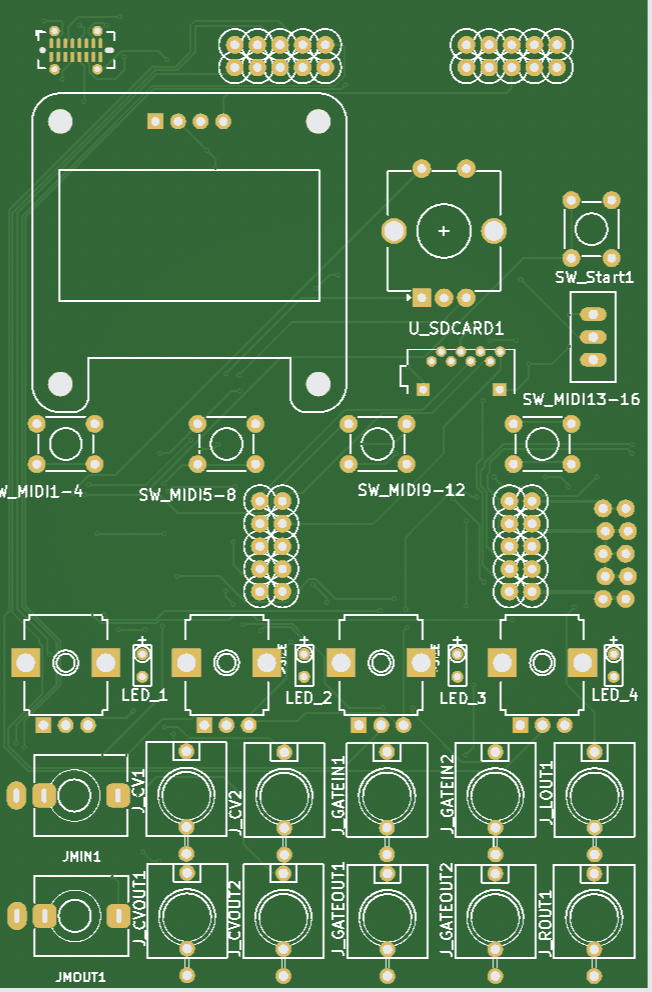
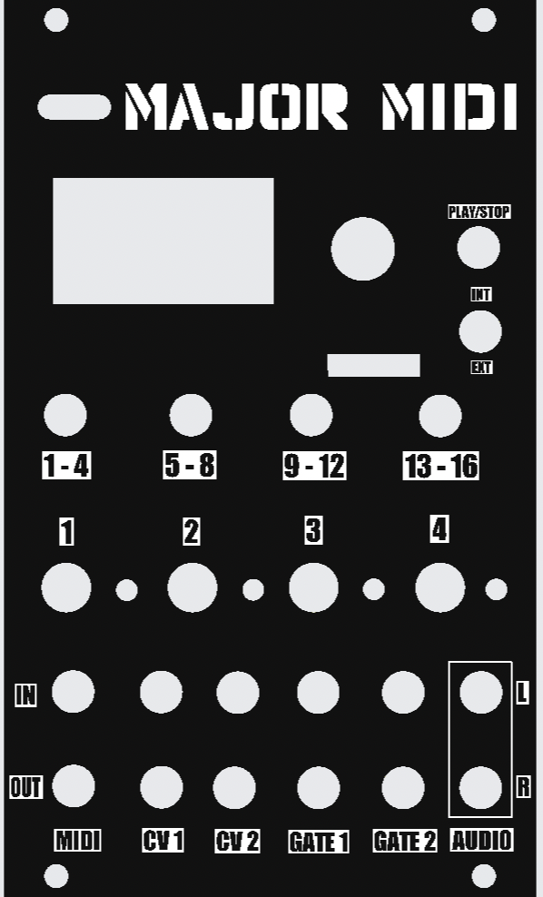

# Major MIDI

Major MIDI turns Daisy Patch SM (STM32H750, Cortex-M7) into a compact Eurorack MIDI file player with a built-in SoundFont 2 synth, live MIDI performance controls, sync options, and modular CV/gate integration.

## The Intention of Major MIDI

Major MIDI is designed to be collaborative and open source. The work does not end with me. It is an invitation to the community to take this creation and bend it, tweak it, extend it, and even break it to serve their own needs. Its continued evolution should be shaped not only by its original design, but by the musicians, programmers, builders, and experimenters who discover possibilities in it that I never anticipated.

Major MIDI is built upon older technologies, much as music itself is built upon the music that came before it. MIDI, General MIDI, MIDI files, and SoundFonts may come from an earlier era of electronic music, but they remain remarkably useful forms of musical communication. They provide a shared vocabulary—one that can be reinterpreted rather than simply preserved. Major MIDI draws upon that vocabulary without treating it as a rigid standard or a finished idea.

Without reference, there is no continuity. But continuity does not mean standing still. As musicians and makers, we must continually evolve, expanding both our musical vocabulary and the technologies we use to create. Innovation does not always require abandoning what came before. Sometimes it means taking familiar ideas out of their original context, combining them with newer tools, and discovering what they can become.

That is central to Major MIDI’s place in a modular system. It brings the structure and memory of MIDI into an environment built around voltage, immediacy, experimentation, and unpredictability. It is meant to connect different generations of musical technology: stored compositions and live performance, MIDI instruments and Eurorack modules, precise sequencing and hands-on control. Rather than forcing one world to behave like the other, Major MIDI is intended to let them interact.

The physical interface is part of that intention. Major MIDI is not meant to hide its capabilities behind a computer or require the musician to stop creating in order to configure it. The display, controls, connections, and software should make it feel like an instrument—something that can be explored, performed, and understood through use. Its technical complexity should create musical possibilities rather than become an obstacle to them.

Major MIDI is also deliberately imperfect and unfinished. It is informed by General MIDI, but it is not an attempt to reproduce every part of the standard or remain fully compliant with it. It takes the elements that remain musically valuable and places them inside a new, open-ended instrument. The goal is not historical preservation for its own sake, but creative reuse.

Major MIDI is therefore an ode to the past with an eye toward the future: a tool shaped by what came before, built for the way musicians work now, and left open for others to imagine what comes next.

## Why Major MIDI

Major MIDI is built for a modular workflow where a playback box needs to feel like an instrument instead of a utility.

| Feature | What it gives you |
| --- | --- |
| SD-based `.mid` playback | Bring complete songs, loops, sketches, or backing parts into the rack |
| SoundFont 2 synth engine | Play those MIDI files directly without an external synth |
| Front-panel channel control | Mix, mute, pan, and swap programs from the module |
| Internal or external sync | Run standalone or lock to the rest of the system |
| CV/gate integration | Patch transport, pitch, CC, clock, and gate behavior into the rack |
| Saved song state | Recall per-song routing, loop, mix, and SF2 choices |
| Browser remote & MIDI transfer | Load songs, mix channels, run transport, and upload `.mid` files over USB from Chrome or Edge |

## At A Glance

| | |
| --- | --- |
| Format | Eurorack, based on Daisy Patch SM (STM32H750) |
| Sound | SoundFont 2 synth, up to 32 voices |
| Storage | microSD card of `.mid` and `.sf2` files |
| MIDI | USB and TRS (UART), in and out |
| CV/Gate | 2 CV in, 2 CV out, 2 gate in, 2 gate out |
| Control | Encoder, Play, 4 bank buttons, 4 knobs, sync switch |
| In the box | Complete assembled module with firmware installed, SD card, power cable |

## Hardware Preview

  <figure class="image-card">
    

      
    

    <figcaption>The board layout shows the Daisy Patch SM footprint, LED positions, MIDI I/O, CV, gate, and audio jack placements.</figcaption>
  </figure>
  <figure class="image-card">
    

      
    

    <figcaption>The panel layout maps the screen, transport controls, bank buttons, channel knobs, and the patch points along the bottom edge.</figcaption>
  </figure>

<figure class="image-card image-card-wide">
  

    
  

  <figcaption>The full module: Daisy Patch SM on the Major MIDI panel, with the display, transport and bank buttons, four performance knobs, and the CV, gate, and MIDI patch points.</figcaption>
</figure>

## What The Site Covers

This site is split into a few focused pages:

- [User Manual](user.html) for the current operating guide.
- [User Manual (PDF)](user_manual.pdf) to download the manual for offline reading or printing.
- [Dev Resources](dev.html) for build notes, source layout, and docs workflow.
- [Order](order.html) for hardware and ordering status.
- [Transfer MIDI](transfer.html) to upload `.mid` files over USB from the browser.
- [Web Remote](remote.html) to browse, load, and mix songs from the browser over USB.

## Core Workflow

The basic Major MIDI flow is simple:

1. Put MIDI files on the SD card.
2. Put one or more SoundFonts on the SD card.
3. Load a song and SF2 from the front panel.
4. Play, sync, loop, and mix from the module.
5. Save song-specific state when the setup is dialed in.

## Who It Is For

| Use case | Why it fits |
| --- | --- |
| Live modular performance | Compact playback with front-panel control |
| Hybrid MIDI + Eurorack rigs | MIDI files, MIDI routing, and CV/gate in one box |
| Sketching arrangements in the rack | Load ideas quickly without a computer on stage |
| Utility playback for drums, bass, or cues | Stable per-song recall and repeatable transport |

## Next Step

If you are trying to use the module right now, start with the [User Manual](user.html).

If you are working on the firmware or documentation site, start with [Dev Resources](dev.html).
